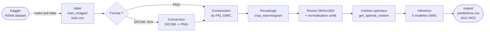

# GMIC Breast Cancer Detection

Pipeline de detection du cancer du sein sur mammographies, base sur le modele [GMIC](https://github.com/nyukat/GMIC).

> Documentation detaillee : [`notebooks/pipeline_gmic.qmd`](notebooks/pipeline_gmic.qmd)

## Flux de donnees



## Installation

```bash

# Avoir conda mieux le mentionner
# 1. Creer l'environnement conda
make build

# 2. Activer l'environnement
conda activate gmic
## plus expliquer la configuration 
# 3. Configurer les cles Kaggle
make setup
```

## Utilisation rapide

```bash
make pull-data  # telecharger les images depuis Kaggle
make validate INPUT_DIR=data/demo  # verifier les donnees (format, CSV, vues)
make preprocess INPUT_DIR=data/demo OUTPUT_DIR=output/demo  # etapes 1-5
make infer OUTPUT_DIR=output/demo  # etapes 6-7
make run INPUT_DIR=data/demo OUTPUT_DIR=output/demo  # wrapper preprocess + infer
make notebook    # executer + rendre notebooks/pipeline_gmic.qmd en HTML
make notebook-serve  # visualiser le HTML dans le navigateur (localhost)
make test       # lancer les tests unitaires
```

Alternative (comme l'aide `make run`) :

```bash
echo "INPUT_DIR=data/demo" >> .env
echo "OUTPUT_DIR=output/demo" >> .env
make run
```

## Commandes disponibles

| Commande | Description |
|---|---|
| `make build` | Creer l'environnement et installer les dependances |
| `make setup` | Configurer `.env`, verifier Kaggle |
| `make check` | Verifier dependances, modeles GMIC, donnees |
| `make pull-data` | Telecharger les donnees depuis Kaggle |
| `make preprocess` | Lancer uniquement le pretraitement (etapes 1-5) |
| `make infer` | Lancer uniquement l'inference (etapes 6-7) |
| `make notebook` | Executer et rendre le notebook de resultats en HTML |
| `make notebook-serve` | Servir le notebook HTML en local (http://localhost:8080) |
| `make run` | Lancer le pipeline complet via le wrapper `run_gmic_pipeline.py` |
| `make freeze` | Figer les versions des packages |
| `make validate` | Valider les donnees d'entree (format, CSV, images) |
| `make test` | Lancer les tests (14 tests) |

Options avancees :

```bash
# Pipeline complet (wrapper)
make run INPUT_DIR=data/demo OUTPUT_DIR=output/demo ARGS="--format png"

# Forcer une etape specifique
make run INPUT_DIR=data/demo OUTPUT_DIR=output/demo ARGS="--force-crop"
make run INPUT_DIR=data/demo OUTPUT_DIR=output/demo ARGS="--force-resize"
make run INPUT_DIR=data/demo OUTPUT_DIR=output/demo ARGS="--force-centers"

# Etapes separees
make preprocess INPUT_DIR=data/demo OUTPUT_DIR=output/demo ARGS="--format auto"
make infer OUTPUT_DIR=output/demo ARGS="--predictions-csv output/demo/preds.csv"
```

## Structure du projet

```
.
├── Makefile
├── pyproject.toml
├── environment.yml           <- Environnement conda (make build)
├── .env.example              <- Copier en .env et remplir
├── GMIC/                     <- Modele GMIC (poids dans GMIC/models/)
├── scripts/
│   ├── preprocess.py         <- Pretraitement GMIC (etapes 1-5)
│   ├── inference.py          <- Inference GMIC (etapes 6-7)
│   ├── run_gmic_pipeline.py  <- Wrapper fin : enchaine preprocess + inference
│   ├── extract_download.py   <- Telechargement Kaggle (anti-429)
│   └── validate_input.py     <- Validation des donnees d'entree
├── notebooks/
│   ├── pipeline_gmic.qmd           <- Inspection des sorties presentes dans output/
│   ├── extract_download.qmd        <- Documentation de l'extraction
│   └── test_validation_report.qmd  <- Rapport de tests avec images
├── tests/
│   └── test_validate_input.py  <- 14 tests (CSV, images, vues)
├── doc/
│   └── troubleshooting.md     <- Erreurs courantes et solutions
├── data/                     <- Images + CSV (gitignore, a remplir)
│   ├── extract_dataset/      <- DICOM depuis Kaggle
│   ├── rsna_images/          <- PNG depuis Kaggle
│   └── test_images/          <- Images de test (mauvais formats)
└── output/                   <- Resultats (genere par make preprocess/make infer/make run)
```

## Prerequis

- [Miniconda](https://docs.conda.io/en/latest/miniconda.html) ou Anaconda
- Compte Kaggle avec acces a la competition [rsna-breast-cancer-detection](https://www.kaggle.com/competitions/rsna-breast-cancer-detection)
- Poids GMIC (`sample_model_1.p` a `sample_model_5.p`) dans `GMIC/models/`

## Limitations

- **Domain shift** : GMIC est entraine sur INbreast/CBIS-DDSM — les performances sur RSNA sont inferieures aux scores publies (AUC ~0.87 sur donnees d'origine)
- **4 vues requises** : L-CC, L-MLO, R-CC, R-MLO par patient
- **CPU only** par defaut
