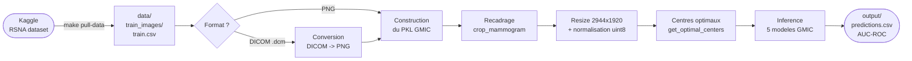

# GMIC Breast Cancer Detection

Pipeline de detection du cancer du sein sur mammographies, base sur le modele
[GMIC](https://github.com/nyukat/GMIC) (Globally-Aware Multiple Instance Classifier).

GMIC est un reseau a deux branches qui reproduit le raisonnement d'un radiologue :
il scanne d'abord l'image entiere (branche globale), identifie les zones suspectes,
puis les analyse en detail (branche locale) avant de fusionner les deux avis
pour produire un score de probabilite de cancer.

Ce repo fournit :
- Le **preprocessing** complet (DICOM/PNG → crop → resize → centres optimaux)
- L'**inference** avec les 5 modeles pre-entraines GMIC (vote ensemble)
- Un systeme de **validation** des donnees d'entree
- Des **notebooks Quarto** pour visualiser chaque etape
- Un jeu de **donnees sample** (2 patients, 8 images) pour tester le pipeline

> **Documentation detaillee** : les rapports HTML sont dans [`docs/`](docs/) (lisibles directement via GitHub Pages).
> - [Rapport de tests](docs/test_validation_report.html) — tests unitaires + validation
> - [Diagnostic pretraitement](docs/preprocess_gmic.html) — visualisation des etapes 1 a 5
> - [Inspection pipeline](docs/pipeline_gmic.html) — predictions et saliency maps

---

## Prerequis

- **[Miniconda](https://docs.conda.io/en/latest/miniconda.html) ou Anaconda** — conda cree un environnement Python isole avec les dependances exactes du projet.
- **[Quarto](https://quarto.org/docs/get-started/)** — pour rendre les notebooks `.qmd` en HTML/PDF (optionnel si vous n'utilisez pas les notebooks).
- **Compte Kaggle** avec acces a la competition [rsna-breast-cancer-detection](https://www.kaggle.com/competitions/rsna-breast-cancer-detection) et une cle API (`kaggle.json`).
- **Poids GMIC** (`sample_model_1.p` a `sample_model_5.p`) a placer dans `GMIC/models/`.
- **GPU NVIDIA** (optionnel) — le pipeline tourne en CPU par defaut. Pour le fine-tuning, un GPU avec CUDA est necessaire.

---

## Installation

```bash
# 1. Creer l'environnement conda avec toutes les dependances
make build

# 2. Activer l'environnement (a faire dans chaque nouveau terminal)
conda activate gmic

# 3. Configurer les cles Kaggle
make setup
```

`make setup` cree un fichier `.env` depuis `.env.example`. Editez-le avec vos identifiants Kaggle :

```ini
KAGGLE_USERNAME=votre_username   # depuis kaggle.json -> "username"
KAGGLE_KEY=votre_api_key         # depuis kaggle.json -> "key"
```

---

## Quickstart — tester avec les donnees sample

Le repo contient un petit jeu de donnees dans `data/sample/` (2 patients, 8 images, ~52 Mo)
pour verifier que tout fonctionne sans avoir a telecharger quoi que ce soit :

```bash
# Lancer le pipeline complet sur les donnees sample
make run INPUT_DIR=data/sample OUTPUT_DIR=output/sample

# Verifier les predictions
cat output/sample/predictions.csv
```

Vous devriez obtenir des predictions pour 8 images avec un AUC-ROC de 1.0 sur ce mini-dataset.

---

## Utilisation

### Pipeline principal

```bash
# Telecharger un subset Kaggle
make pull-data

# Valider les donnees (format images, CSV)
make validate INPUT_DIR=data/demo

# Pipeline complet en une commande (preprocess + inference)
make run INPUT_DIR=data/demo OUTPUT_DIR=output/demo

# Ou etape par etape :
make preprocess INPUT_DIR=data/demo OUTPUT_DIR=output/demo
make infer OUTPUT_DIR=output/demo
```

### Options avancees

```bash
# Forcer une etape specifique
make preprocess INPUT_DIR=data/demo OUTPUT_DIR=output/demo ARGS="--force-crop"
make preprocess INPUT_DIR=data/demo OUTPUT_DIR=output/demo ARGS="--force-resize"

# Format explicite (auto-detecte par defaut)
make preprocess INPUT_DIR=data/demo OUTPUT_DIR=output/demo ARGS="--format png"
```

---

## Tests

Deux commandes complementaires :

| Commande | Question | Quoi |
|---|---|---|
| `make test` | "Mon **code** marche ?" | Fabrique des fausses images et verifie que le validateur les detecte |
| `make validate INPUT_DIR=...` | "Mes **donnees** sont bonnes ?" | Verifie vos vraies images (format, taille, CSV) |

```bash
make test                          # tests unitaires (images synthetiques, rapide)
make validate INPUT_DIR=data/sample  # validation de vraies images
```

---

## Notebooks (Quarto)

Les notebooks sont au format `.qmd` ([Quarto](https://quarto.org)) et se rendent en HTML ou PDF.

### Deux types de notebooks

| Notebook | Type | Ce qu'il fait | PDF |
|---|---|---|---|
| `test` | **Executeur** | Lance `pytest` + `check_image()` a chaque rendu | [test_validation_report.html](docs/test_validation_report.html) |
| `extract` | **Executeur** | Telecharge les images depuis Kaggle a chaque rendu | — |
| `preprocess` | **Visionneuse** | Lit ce que `make preprocess` a produit dans `OUTPUT_DIR` | [preprocess_gmic.html](docs/preprocess_gmic.html) |
| `pipeline` | **Visionneuse** | Lit ce que `make infer` a produit dans `OUTPUT_DIR` | [pipeline_gmic.html](docs/pipeline_gmic.html) |

> Les notebooks **visionneuses** (`preprocess`, `pipeline`) ne montrent rien si `OUTPUT_DIR` est vide.
> Il faut d'abord lancer le pipeline (ex: `make run INPUT_DIR=data/sample OUTPUT_DIR=output/sample`).

### Commandes

```bash
# Generer un HTML statique
make notebook NOTEBOOK=test                               # rapport de tests
make notebook NOTEBOOK=preprocess OUTPUT_DIR=output/sample  # diagnostic pretraitement
make notebook NOTEBOOK=pipeline   OUTPUT_DIR=output/sample  # inspection predictions

# Previsualiser en live (re-execute a chaque sauvegarde du .qmd)
make notebook-serve NOTEBOOK=test
make notebook-serve NOTEBOOK=preprocess OUTPUT_DIR=output/sample
```

> Les `.html` generes dans `script_notebook/` sont ignores par git. Les rapports de reference sont dans `docs/`.

---

## Flux de donnees



---

## Commandes disponibles

| Commande | Description |
|---|---|
| `make build` | Creer l'environnement et installer les dependances |
| `make setup` | Configurer `.env`, verifier Kaggle |
| `make check` | Verifier dependances, modeles GMIC, donnees |
| `make pull-data` | Telecharger les donnees depuis Kaggle |
| `make validate` | Valider les donnees d'entree (format, CSV, images) |
| `make run` | Lancer la pipeline complete GMIC en une seule commande |
| `make preprocess` | Lancer uniquement le pretraitement (etapes 1-5) |
| `make infer` | Lancer uniquement l'inference (etapes 6-7) |
| `make notebook [NOTEBOOK=...]` | Rendre un notebook en HTML |
| `make notebook-serve [NOTEBOOK=...]` | Previsualiser un notebook en live |
| `make freeze` | Figer les versions des packages |
| `make test` | Lancer les tests unitaires |

---

## Structure du projet

```
.
├── Makefile
├── pyproject.toml
├── environment.yml           <- Environnement conda (make build)
├── .env.example              <- Copier en .env et remplir
├── GMIC/                     <- Modele GMIC (poids dans GMIC/models/)
├── scripts/
│   ├── run_gmic_pipeline.py  <- Pipeline complet (make run)
│   ├── preprocess.py         <- Pretraitement GMIC (etapes 1-5)
│   ├── inference.py          <- Inference GMIC (etapes 6-7)
│   ├── extract_download.py   <- Telechargement Kaggle (anti-429)
│   └── validate_input.py     <- Validation des donnees d'entree
├── script_notebook/
│   ├── pipeline_gmic.qmd           <- Inspection des sorties
│   ├── preprocess_gmic.qmd         <- Diagnostic du pretraitement
│   ├── extract_download.qmd        <- Documentation de l'extraction
│   └── test_validation_report.qmd  <- Rapport de tests avec images
├── tests/
│   └── test_validate_input.py  <- Tests unitaires (CSV, images)
├── docs/                            <- GitHub Pages (rapports HTML)
│   ├── test_validation_report.html  <- Rapport de tests
│   ├── preprocess_gmic.html         <- Diagnostic pretraitement
│   ├── pipeline_gmic.html           <- Inspection pipeline
│   └── troubleshooting.md           <- Erreurs courantes et solutions
├── data/
│   ├── sample/               <- Donnees de demo (2 patients, 8 images, ~52 Mo)
│   └── test_images/          <- Images de test (mauvais formats)
└── output/                   <- Resultats (genere par make preprocess/make infer)
```

---

## Limitations

- **Domain shift** : GMIC est entraine sur INbreast/CBIS-DDSM — les performances sur RSNA sont inferieures aux scores publies (AUC ~0.87 sur donnees d'origine)
- **Au minimum 1 image par patient** : GMIC analyse chaque image individuellement
- **CPU only** par defaut — GPU NVIDIA requis pour le fine-tuning
