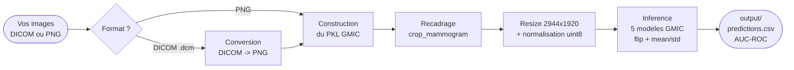

# GMIC Breast Cancer Detection

Pipeline de detection du cancer du sein sur mammographies, base sur le modele
[GMIC](https://github.com/nyukat/GMIC) (Globally-Aware Multiple Instance Classifier).

GMIC est un reseau a deux branches qui reproduit le raisonnement d'un radiologue :
il scanne d'abord l'image entiere (branche globale), identifie les zones suspectes,
puis les analyse en detail (branche locale) avant de fusionner les deux avis
pour produire un score de probabilite de cancer.

Ce repo fournit :
- Le **preprocessing** (DICOM/PNG → crop → resize 2944×1920)
- L'**inference** avec les 5 modeles pre-entraines GMIC (vote ensemble)
- Un systeme de **validation** des donnees d'entree
- Des **notebooks Quarto** pour visualiser chaque etape
- Un jeu de **donnees sample** (2 patients, 8 images) pour tester le pipeline

> **Documentation detaillee** : les rapports HTML sont dans [`docs/`](docs/) (lisibles directement via GitHub Pages).
> - [Rapport de tests](docs/test_validation_report.html) — tests unitaires + validation
> - [Diagnostic pretraitement](docs/preprocess_gmic.html) — visualisation des etapes
> - [Inspection pipeline](docs/pipeline_gmic.html) — predictions et saliency maps

---

## Flux de donnees



---

## Prerequis

- **[Miniconda](https://docs.conda.io/en/latest/miniconda.html) ou Anaconda** — conda cree un environnement Python isole avec les dependances exactes du projet.
- **[Quarto](https://quarto.org/docs/get-started/)** — pour rendre les notebooks `.qmd` en HTML (optionnel).
- **Poids GMIC** (`sample_model_1.p` a `sample_model_5.p`) a placer dans `GMIC/models/`.
- **Vos images** — DICOM ou PNG, organisees par patient avec un `train.csv`.

> **Donnees de test incluses** : `data/sample/` contient 2 patients (8 images, ~52 Mo) — aucun telechargement necessaire pour tester le pipeline.
>
> **Dataset complet (optionnel)** : pour utiliser le dataset RSNA (~1.5 Go), voir [docs/kaggle_setup.md](docs/kaggle_setup.md).

---

## Format des donnees d'entree

```
INPUT_DIR/
├── train.csv
└── train_images/
    ├── <patient_id>/
    │   ├── <image_id>.png   (ou .dcm)
    │   └── ...
    └── ...
```

Le CSV doit contenir ces colonnes :

| Colonne | Description |
|---|---|
| `patient_id` | Correspond au nom du sous-dossier dans `train_images/` |
| `image_id` | Correspond au nom du fichier (sans extension) |
| `laterality` | `L` ou `R` (gauche / droite) |
| `view` | `CC` ou `MLO` |
| `cancer` | `0` ou `1` |

> GMIC s'attend a **4 vues par patient** (L-CC, L-MLO, R-CC, R-MLO).
> Un patient avec une vue manquante est ignore a l'inference.
> Les images peuvent etre en **PNG** ou **DICOM** — le format est auto-detecte.

---

## Installation

```bash
# 1. Creer l'environnement conda avec toutes les dependances
make build

# 2. Activer l'environnement (a faire dans chaque nouveau terminal)
conda activate gmic

# 3. Verifier que tout est en place
make check
```

---

## Quickstart — tester avec les donnees sample

Le repo contient un petit jeu de donnees dans `data/sample/` (2 patients, 8 images, ~52 Mo)
pour verifier que tout fonctionne sans avoir a telecharger quoi que ce soit :

```bash
# Lancer le pipeline complet sur les donnees sample
make run INPUT_DIR=data/sample OUTPUT_DIR=output/sample

# Verifier les predictions
cat output/sample/predictions.csv
```

Vous devriez obtenir des predictions pour 8 images avec un AUC-ROC de 1.0 sur ce mini-dataset.

---

## Utilisation

```bash
# Valider vos donnees (format images, CSV)
make validate INPUT_DIR=data/demo

# Pipeline complet en une commande (preprocess + inference)
make run INPUT_DIR=data/demo OUTPUT_DIR=output/demo

# Ou etape par etape :
make preprocess INPUT_DIR=data/demo OUTPUT_DIR=output/demo
make infer OUTPUT_DIR=output/demo
```

### Options avancees

```bash
# Forcer une etape specifique
make preprocess INPUT_DIR=data/demo OUTPUT_DIR=output/demo ARGS="--force-crop"
make preprocess INPUT_DIR=data/demo OUTPUT_DIR=output/demo ARGS="--force-resize"

# Format explicite (auto-detecte par defaut)
make preprocess INPUT_DIR=data/demo OUTPUT_DIR=output/demo ARGS="--format png"
```

---

## Tests

Deux commandes complementaires :

| Commande | Question | Quoi |
|---|---|---|
| `make test` | "Mon **code** marche ?" | Fabrique des fausses images et verifie que le validateur les detecte |
| `make validate INPUT_DIR=...` | "Mes **donnees** sont bonnes ?" | Verifie vos vraies images (format, taille, CSV) |

```bash
make test                            # tests unitaires (images synthetiques, rapide)
make validate INPUT_DIR=data/sample  # validation de vraies images
```

---

## Notebooks (Quarto)

Les notebooks sont au format `.qmd` ([Quarto](https://quarto.org)) et se rendent en HTML ou PDF.

| Notebook | Type | Ce qu'il fait |
|---|---|---|
| `test` | **Executeur** | Lance `pytest` + `check_image()` a chaque rendu — [rapport HTML](docs/test_validation_report.html) |
| `preprocess` | **Visionneuse** | Explique les etapes de preprocessing avec visuels — [rapport HTML](docs/preprocess_gmic.html) |
| `pipeline` | **Visionneuse** | Lit ce que `make infer` a produit dans `OUTPUT_DIR` — [rapport HTML](docs/pipeline_gmic.html) |

> Les notebooks **visionneuses** (`preprocess`, `pipeline`) ne montrent rien si `OUTPUT_DIR` est vide.
> Il faut d'abord lancer le pipeline (ex: `make run INPUT_DIR=data/sample OUTPUT_DIR=output/sample`).

```bash
# Generer un HTML statique
make notebook NOTEBOOK=test                                  # rapport de tests
make notebook NOTEBOOK=preprocess OUTPUT_DIR=output/sample  # diagnostic pretraitement
make notebook NOTEBOOK=pipeline   OUTPUT_DIR=output/sample  # inspection predictions

# Generer un PDF statique
make notebook-pdf NOTEBOOK=pipeline OUTPUT_DIR=output/sample # inspection predictions (PDF)

# Previsualiser en live (re-execute a chaque sauvegarde du .qmd)
make notebook-serve NOTEBOOK=preprocess OUTPUT_DIR=output/sample
```

> Les `.html` generes dans `script_notebook/` sont ignores par git. Les rapports de reference sont dans `docs/`.

---

## Commandes disponibles

| Commande | Description |
|---|---|
| `make build` | Creer l'environnement conda et installer les dependances |
| `make check` | Verifier dependances, modeles GMIC, donnees |
| `make validate` | Valider les donnees d'entree (format, CSV, images) |
| `make run` | Lancer le pipeline complet GMIC en une seule commande |
| `make preprocess` | Lancer uniquement le pretraitement (crop + resize) |
| `make infer` | Lancer uniquement l'inference (flip + normalisation + modele) |
| `make notebook [NOTEBOOK=...]` | Rendre un notebook en HTML |
| `make notebook-pdf [NOTEBOOK=...]` | Rendre un notebook en PDF |
| `make notebook-serve [NOTEBOOK=...]` | Previsualiser un notebook en live |
| `make freeze` | Figer les versions des packages |
| `make test` | Lancer les tests unitaires |

---

## Structure du projet

```
.
├── Makefile
├── pyproject.toml
├── environment.yml           <- Environnement conda (make build)
├── GMIC/                     <- Modele GMIC (poids dans GMIC/models/)
├── scripts/
│   ├── run_gmic_pipeline.py  <- Pipeline complet (make run)
│   ├── preprocess.py         <- Pretraitement (DICOM/PNG -> crop -> resize)
│   ├── inference.py          <- Inference (flip + mean/std + 5 modeles GMIC)
│   └── validate_input.py     <- Validation des donnees d'entree
├── extraction_project/       <- Telechargement Kaggle (voir docs/kaggle_setup.md)
├── script_notebook/
│   ├── pipeline_gmic.qmd           <- Inspection des sorties
│   ├── preprocess_gmic.qmd         <- Guide visuel du pretraitement
│   └── test_validation_report.qmd  <- Rapport de tests avec images
├── tests/
│   └── test_validate_input.py  <- Tests unitaires (CSV, images)
├── docs/                            <- GitHub Pages (rapports HTML)
│   ├── test_validation_report.html
│   ├── preprocess_gmic.html
│   ├── pipeline_gmic.html
│   ├── kaggle_setup.md              <- Guide telechargement Kaggle
│   └── troubleshooting.md           <- Erreurs courantes et solutions
├── data/
│   ├── sample/               <- Donnees de demo (2 patients, 8 images, ~52 Mo)
│   └── test_images/          <- Images de test (mauvais formats)
└── output/                   <- Resultats (genere par make preprocess/make infer)
```

---

## Limitations

- **Domain shift** : GMIC est entraine sur INbreast/CBIS-DDSM — les performances sur RSNA sont inferieures aux scores publies (AUC ~0.87 sur donnees d'origine)
- **Au minimum 1 image par patient** : GMIC analyse chaque image individuellement
- **CPU only** par defaut — GPU NVIDIA requis pour le fine-tuning
