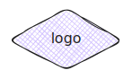
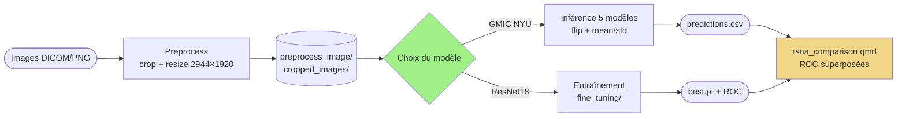

# Détection de cancer du sein sur mammographies

[](https://www.python.org/)
[](https://pytorch.org/)
[](LICENSE)

> Pipeline d'analyse de mammographies basé sur le modèle [GMIC](https://github.com/nyukat/GMIC)
> (Globally-Aware Multiple Instance Classifier) de NYU, complété par un entraînement
> ResNet18 sur le dataset RSNA pour la comparaison.
> Destiné à des fins **pédagogiques et de recherche** (stage Epiconcept).

- Inférence GMIC pré-entraîné NYU (5 modèles ensemble) sur DICOM ou PNG
- Entraînement ResNet18 from-scratch sur RSNA (cible cancer ou « normalité »)
- Comparaison ResNet18 vs GMIC sur le même val set (notebook Quarto)

---

## 📊 Overview



| Module | Rôle |
|:---|:---|
| `scripts/preprocess.py` | DICOM/PNG → crop → resize 2944×1920, écrit `data.pkl` |
| `scripts/run_gmic_pipeline.py` | Wrapper preprocess + inférence GMIC |
| `fine_tuning/train_resnet.py` | Entraînement ResNet18 sur label `cancer` |
| `fine_tuning/train_resnet_normalite.py` | Entraînement ResNet18 sur label « normalité » (cancer ∨ biopsy ∨ difficult) |
| `script_notebook/rsna_comparison.qmd` | Compare ResNet18 vs GMIC (ROC + visualisations) |
| `script_notebook/gmic.qmd` | Décortique l'architecture GMIC (BasicBlock → Local/Global → fusion) |

---

## ⚒️ Prerequisites & Installation

### Prérequis système

- **Conda** ([Miniconda](https://docs.conda.io/en/latest/miniconda.html) recommandé)
- **GPU NVIDIA** (sm_61+) — projet testé sur Quadro P1000 avec torch 2.4.1+cu121
- **[Quarto](https://quarto.org/docs/get-started/)** pour rendre les notebooks
- **Poids GMIC** (`sample_model_1.p` à `sample_model_5.p`) à placer dans `GMIC/models/`
  ([instructions de téléchargement](https://github.com/nyukat/GMIC#how-to-run-the-code))

### Installation

```bash
# Cloner le repo
git clone https://github.com/joshdeutc/projet_cancer_sein.git
cd projet_cancer_sein

# Créer l'environnement conda (env "gmic", Python 3.11 + PyTorch GPU)
make build

# Activer l'environnement
conda activate gmic

# Vérifier l'install
python -c "import torch; print('CUDA:', torch.cuda.is_available(), '|', torch.__version__)"
```

> Le submodule `modules/make-recipes/` (recettes Epiconcept partagées) nécessite un accès
> à `Epiconcept-Paris/data-make-recipes` (privé). Sans cet accès, ignorer
> `git submodule update --init --recursive` — le projet fonctionne sans.

---

## 🤩 Minimal Example

### 1. Inférence GMIC sur des images de démo

```bash
conda activate gmic
python -m scripts.run_gmic_pipeline \
    --input data/sample \
    --output preprocess_image/sample
# → preprocess_image/sample/predictions.csv
```

### 2. Entraînement ResNet18 (cible « normalité »)

```bash
python -m fine_tuning.train_resnet_normalite
# → fine_tuning/checkpoints/runs/{timestamp}_normalite_scratch/
#    ├── best.pt        (state_dict + val_preds + val_targets + val_auc + epoch)
#    ├── args.json      (hyperparams)
#    ├── logs.json      (métriques par epoch)
#    └── roc.png        (courbe ROC du best epoch)
```

### 3. Render d'un notebook Quarto

```bash
# Notebooks disponibles : gmic, resnet18_training, rsna_comparison
make notebook NOTEBOOK=rsna_comparison           # → HTML dans script_notebook/
make run NOTEBOOK=rsna_comparison                # live preview dans le navigateur
```

---

## 📁 Structure du projet

```
.
├── Makefile                       # 6 cibles : build, run, notebook, test, freeze, help
├── environment.yml                # env conda "gmic" (Python 3.11 + PyTorch CUDA)
├── requirements.txt               # alternative pip (sans GPU garanti)
├── pyproject.toml                 # metadata projet
├── logo.svg
├── GMIC/                          # code original NYU + poids dans GMIC/models/
├── scripts/                       # pipeline de preprocessing + inférence GMIC
├── fine_tuning/                   # entraînement ResNet18 (cancer + normalité)
│   ├── train_resnet.py
│   ├── train_resnet_normalite.py
│   ├── dataset.py
│   ├── config.py
│   └── checkpoints/runs/          # checkpoints horodatés (gitignored)
├── script_notebook/               # notebooks Quarto (.qmd)
│   ├── gmic.qmd                   # explique l'architecture GMIC
│   ├── resnet18_training.qmd      # courbes d'entraînement ResNet18
│   └── rsna_comparison.qmd        # compare ResNet18 vs GMIC sur le val set
├── tests/                         # pytest sur le validateur d'entrée
├── docs/                          # rendus PDF/HTML de référence
├── data/                          # gitignored sauf data/sample/
└── preprocess_image/              # sorties du preprocessing (gitignored)
```

---

## 📚 Resources

- **GMIC** — [Shen et al., An interpretable classifier for high-resolution breast cancer screening images, 2020](https://arxiv.org/abs/2002.07613) ([code NYU](https://github.com/nyukat/GMIC))
- **RSNA** — [RSNA Screening Mammography Breast Cancer Detection (Kaggle)](https://www.kaggle.com/competitions/rsna-breast-cancer-detection)
- **Setup Kaggle CLI** — [docs/kaggle_setup.md](docs/kaggle_setup.md)
- **Troubleshooting** — [docs/troubleshooting.md](docs/troubleshooting.md)
- **Notebooks rendus** — voir [docs/](docs/) pour les PDF de référence

---

## 🤝 Contribution

- **Issues** : ouvrir un ticket sur [GitHub Issues](https://github.com/joshdeutc/projet_cancer_sein/issues)
- **PR** : forker, créer une branche, ouvrir une pull request
- **Tests** : `make test` doit passer avant tout merge

---

## 📱 Contact

joshuanancey@gmail.com — stage Epiconcept (Avril 2026)

---
